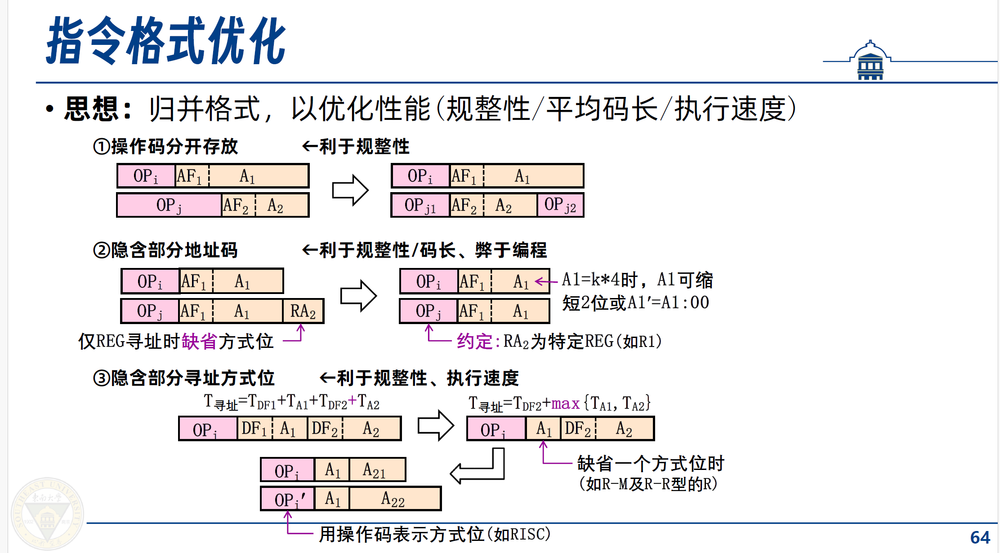

# 算法设计与分析
This file is for my “Algorithm design and analysis”.
well,we have couple of questions,and until now i have finished about 20 questions,so come on!!!!
2024.5.10 I spent one hour but fail to pass the Dijkstra question ,sad about it.
2024.5.10 we add a picture,and this is for the 1031 question.
2024.5.24还是用中文吧，这几道题都很惹火，不太好写，写了也不太好过，建议学习测试用例的来源，并且攻破它。
emmm，方老师很爱笑，在这里浅浅记录一下吧。
2024.5.28 git log退出方式q，d查看历史提交。vim的normal模式无法插入。
2024.6.3 注意开始看算法题了，因为单老师的ppt有特色一点，也揭示了一些东西
## 分治
1.划分成两部分
2.对子问题递归求解
3.合并子问题的解
## 动态规划
状态和状态转移方程
## 贪心
按照某种贪心策略做出决策
## 网络流
## NP完全问题
## 近似