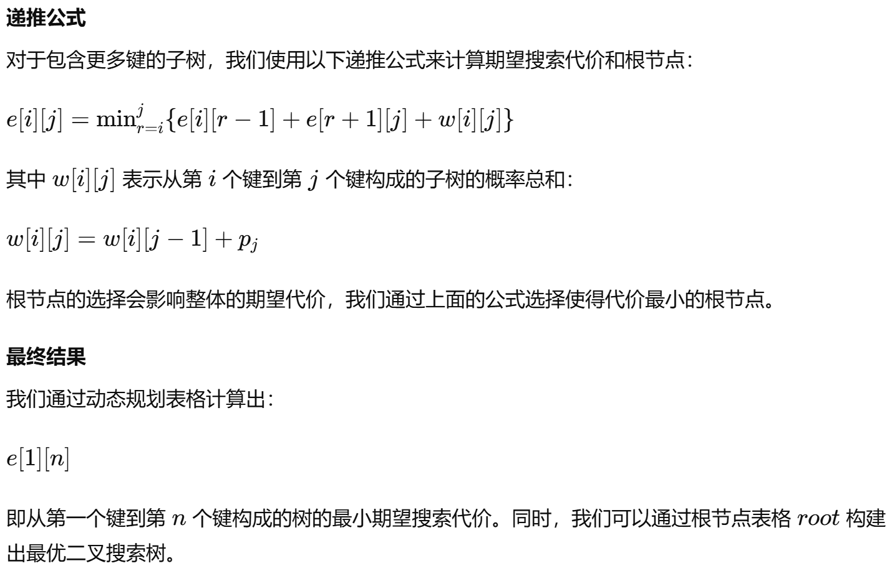

# 算法设计与分析
This file is for my “Algorithm design and analysis”.
well,we have couple of questions,and until now i have finished about 20 questions,so come on!!!!
2024.5.10 I spent one hour but fail to pass the Dijkstra question ,sad about it.
2024.5.10 we add a picture,and this is for the 1031 question.
2024.5.24还是用中文吧，这几道题都很惹火，不太好写，写了也不太好过，建议学习测试用例的来源，并且攻破它。
emmm，方老师很爱笑，在这里浅浅记录一下吧。
2024.5.28 git log退出方式q，d查看历史提交。vim的normal模式无法插入。
2024.6.3 注意开始看算法题了，因为单老师的ppt有特色一点，也揭示了一些东西
## 基本数学运算
### 递归方程
变量替换法求解
T(n)=2T(√n)+logn
令 m=logn，则n=2^m， T(2^m)=2T(2^m/2)+m
令 S(m)=T(2^m)，则 S(m/2)=T(2^m/2)
于是 S(m)=2S(m/2)+m
显然 S(m)=Θ(mlogm)
则 T(n)=Θ(lognlog(logn))
1.MASTER定理求解
求解 T(n)=a∙T(n/b)+f(n) 型递归方程，其中a≥1，b>1 是常数，f(n) 是正函数
记住三种情况，可快速求解
其实就是f（n）和n^logb(a)谁大是谁
## 分治
1.划分成两部分
2.对子问题递归求解
3.合并子问题的解
## 动态规划
状态和状态转移方程（顺带完成两道力扣题）
(1)最长公共子序列
状态转移方程：*if (num1 == num2) {dp[i][j] = dp[i - 1][j - 1] + 1;} else {dp[i][j] = max(dp[i - 1][j], dp[i][j - 1]);}*
(2)最优二叉搜索树
状态转移方程：
## 贪心
1.条件：最优子结构和贪心选择性
（1）最优子结构：当一个问题的最优解包含子问题的最优解时，称这个问题具有最优子结构
（2）贪心选择性：当一个问题的全局最优解可以通过局部最优解得到，称这个问题具有贪心选择性
按照某种贪心策略做出决策
2.例题
（1）活动选择问题
问题定义
输入：S={1, 2, …, n}，xi=[si，fi]，1  i  n
输出：S的最大相容集合
贪心思想
为了选择更多活动，每次选择 **fi 最小的活动**
证明我是看的云里雾里
（2）哈夫曼编码
离散数学中学过，排序构造树使带权路径最小
（3）并查集
合并两棵树操作：秩小的作为秩大的子树，或者节点数少的。。。。
（4）最小生成树（无向图）
（5）最短路径（有向图）
3.考题
（1）分数背包问题（单位重量的背包价值）
（2）基站布置（按照船的覆盖区间的右端点排序，每确定一个基站就把可以覆盖到的船删除）
（3）黑白连线（用两个栈，每次碰到一个点就进行相应选择）
（4）作业调度问题（按收益排序，向前安排时间槽，没有时间槽则放弃）
（5）凑美元问题
## 网络流
## NP完全问题
## 近似
# 期末考试
## 判断题
P,NP,NPC,渐进时间复杂度，上界，下界，递归表达式
## 算法题
直接看孙学长的pdf，我靠有题学长是真做啊，把所有班级的题都做了一遍，真的很强。
## 算法能力
具备抽象描述、解决实际问题的能力
学会运用算法设计与分析的典型方法进行算法的设计
具备分析算法效率的能力。

